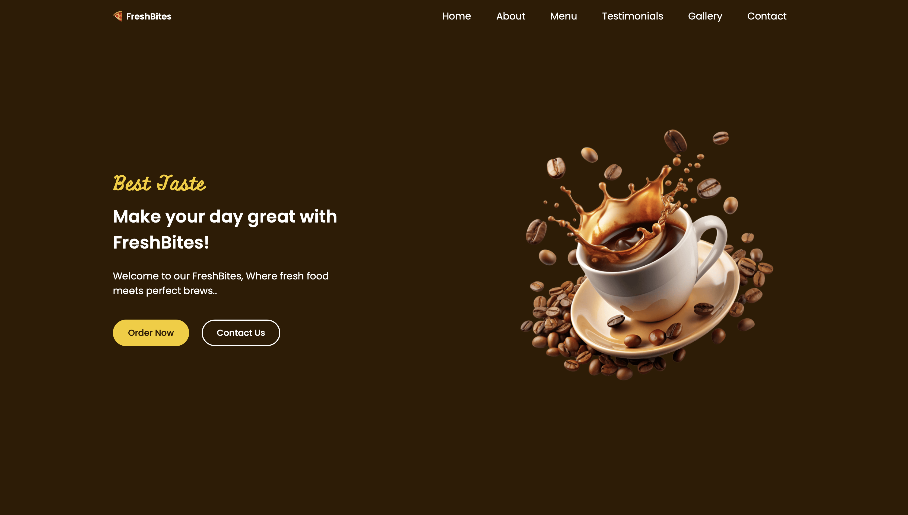
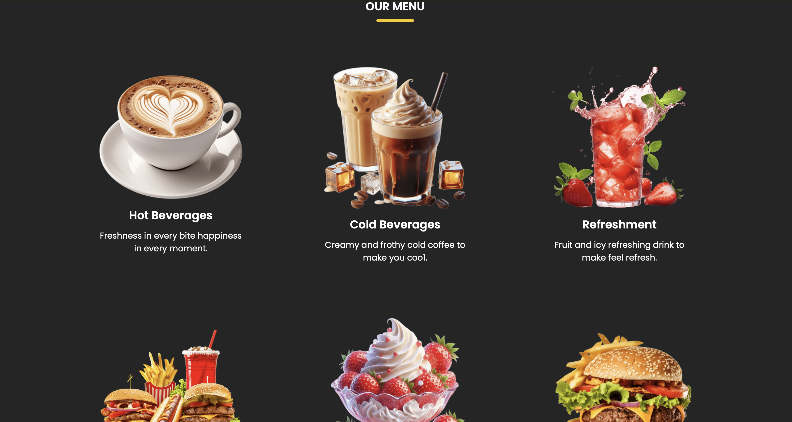

# 🍕 FreshBites

**FreshBites** is a modern and responsive restaurant website built using **HTML, CSS, and JavaScript**.  
It showcases a stylish food and beverage landing page with menu sections, testimonials, gallery, and contact form.

---

## 📌 Features

- 🏠 Hero section with call-to-action buttons
- 📖 About Us section
- 🍹 Menu section (Hot Beverages, Cold Beverages, Refreshments, Fast Food)
- ⭐ Testimonials slider
- 🖼️ Gallery section
- 📞 Contact form with business details
- 📱 Responsive design
- 🎨 Modern UI with smooth layout

---

## 📂 Project Structure
FreshBites/
│
├── index.html
├── style.css
├── script.js
└── README.md

---

## 📸 Screenshots

### Home Page

### Gallery Section

### Menu Section

---

## © Copyright

Copyright © 2026 **FreshBites**  
All rights reserved.

---

## 📧 Contact

For any questions or support, feel free to reach out:

- Email: **m.azizullah420@gmail.com**